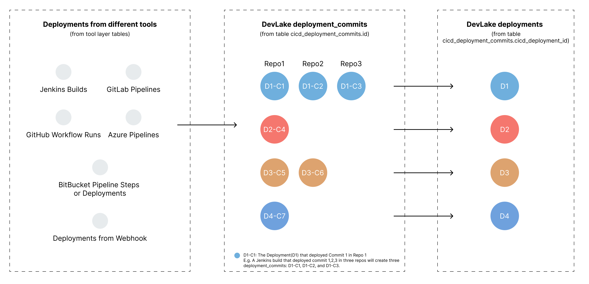

## What is this metric?

How often an organization deploys code to production or release it to end users. Below is a picture showing the definition of DevLake `deployments`.



## Why is it important?

Deployment frequency reflects the efficiency of a team's deployment. A team that deploys more frequently can deliver the product faster and users' feature requirements can be met faster.

## Which dashboard(s) does it exist in

DORA dashboard. See [live demo](https://grafana-lake.demo.devlake.io/grafana/d/qNo8_0M4z/dora?orgId=1).

## How is it calculated?

Deployment frequency is calculated based on the number of `deployment days`, not the number of deployments, e.g., daily, weekly, monthly, yearly.

When there are multiple deployments triggered by one pipeline, tools like GitLab and BitBucket will generate more than one deployment. In these cases, DevLake will consider these deployments as ONE deployment and use the last deployment's finished date as the deployment finished date.

Below are the 2023 DORA benchmarks for different development teams from Google's report. However, it's difficult to tell which group a team falls into when the team's deployment frequency is `between once per week and once per month`. Therefore, DevLake provides its own benchmarks to address this problem:


| Groups            | Benchmarks                                     | DevLake Benchmarks                             | The Criteria of DevLake Benchmarks                |
| ----------------- | ---------------------------------------------- | ---------------------------------------------- | --------------------------------------------------|
| Elite performers  | On-demand (multiple deploys per day)           | On-demand                                      | Median Number of `Deployment Days` per Week >= 7  |
| High performers   | Between once per day and once per week         | Between once per day and once per week         | Median Number of `Deployment Days` per Week >= 1  |
| Medium performers | Between once per week and once per month       | Between once per week and once per month       | Median Number of `Deployment Days` per Month >= 1 |
| Low performers    | Between once per week and once per month       | Fewer than once per month                      | Median Number of `Deployment Days` per Month < 1  |

<p><i>Source: 2023 Accelerate State of DevOps, Google</i></p>


<details>
<summary>Click to expand or collapse 2021 DORA benchmarks</summary>

| Groups            | Benchmarks                                     | DevLake Benchmarks                             | The Criteria of DevLake Benchmarks                |
| ----------------- | ---------------------------------------------- | ---------------------------------------------- | --------------------------------------------------|
| Elite performers  | On-demand (multiple deploys per day)           | On-demand                                      | Median Number of `Deployment Days` per Week >= 7  |
| High performers   | Between once per week and once per month       | Between once per day and once per month       | Median Number of `Deployment Days` per Month >= 1  |
| Medium performers | Between once per month and once every 6 months | Between once per month and once every 6 months | Median Number of `Deployment Days` per six Months >= 1 |
| Low performers    | Fewer than once per six months                 | Fewer than once per six months                 | Median Number of `Deployment Days` per six Months < 1  |

<p><i>Source: 2021 Accelerate State of DevOps, Google</i></p>
</details>
<br>
</br>


<b>Data Sources Required</b>

- `Deployments` from Jenkins, GitLab CI, GitHub Action, BitBucket Pipelines, Webhook, etc. 


<b>Transformation Rules Required</b>

Define `deployment` in [data transformations](https://devlake.apache.org/docs/Configuration/Tutorial#step-3---add-transformations-optional) while configuring the blueprint of a project to let DevLake know what CI records can be regarded as deployments.

<b>SQL Queries</b>

DevLake deployments can be found in table [cicd_deployment_commits](/docs/DataModels/DevLakeDomainLayerSchema.md#cicd_deployment_commits). If you want to measure the monthly trend of deployment count as the picture shown below, run the following SQL in Grafana.


```
-- Metric 1: Number of deployments per month
with _deployments as(
-- When deploying multiple commits in one pipeline, GitLab and BitBucket may generate more than one deployment. However, DevLake consider these deployments as ONE production deployment and use the last one's finished_date as the finished date.
	SELECT 
		date_format(deployment_finished_date,'%y/%m') as month,
		count(cicd_deployment_id) as deployment_count
	FROM (
		SELECT
			cdc.cicd_deployment_id,
			max(cdc.finished_date) as deployment_finished_date
		FROM cicd_deployment_commits cdc
		JOIN project_mapping pm on cdc.cicd_scope_id = pm.row_id and pm.`table` = 'cicd_scopes'
		WHERE
			pm.project_name in (${project:sqlstring}+'')
			and cdc.result = 'SUCCESS'
			and cdc.environment = 'PRODUCTION'
		GROUP BY 1
		HAVING $__timeFilter(max(cdc.finished_date))
	) _production_deployments
	GROUP BY 1
)

SELECT 
	cm.month, 
	case when d.deployment_count is null then 0 else d.deployment_count end as deployment_count
FROM 
	calendar_months cm
	LEFT JOIN _deployments d on cm.month = d.month
	WHERE $__timeFilter(cm.month_timestamp)
```

If you want to measure in which category your team falls as in the picture shown below, run the following SQL in Grafana. Unlike monthly deployments which are based on the number of deployments, the metric below is based on `deployment days`.


```
-- Metric 1: Deployment Frequency
with last_few_calendar_months as(
-- construct the last few calendar months within the selected time period in the top-right corner
	SELECT CAST((SYSDATE()-INTERVAL (H+T+U) DAY) AS date) day
	FROM ( SELECT 0 H
			UNION ALL SELECT 100 UNION ALL SELECT 200 UNION ALL SELECT 300
		) H CROSS JOIN ( SELECT 0 T
			UNION ALL SELECT  10 UNION ALL SELECT  20 UNION ALL SELECT  30
			UNION ALL SELECT  40 UNION ALL SELECT  50 UNION ALL SELECT  60
			UNION ALL SELECT  70 UNION ALL SELECT  80 UNION ALL SELECT  90
		) T CROSS JOIN ( SELECT 0 U
			UNION ALL SELECT   1 UNION ALL SELECT   2 UNION ALL SELECT   3
			UNION ALL SELECT   4 UNION ALL SELECT   5 UNION ALL SELECT   6
			UNION ALL SELECT   7 UNION ALL SELECT   8 UNION ALL SELECT   9
		) U
	WHERE
		(SYSDATE()-INTERVAL (H+T+U) DAY) > $__timeFrom()
),

_production_deployment_days as(
-- When deploying multiple commits in one pipeline, GitLab and BitBucket may generate more than one deployment. However, DevLake consider these deployments as ONE production deployment and use the last one's finished_date as the finished date.
	SELECT
		cdc.cicd_deployment_id as deployment_id,
		max(DATE(cdc.finished_date)) as day
	FROM cicd_deployment_commits cdc
	JOIN project_mapping pm on cdc.cicd_scope_id = pm.row_id and pm.`table` = 'cicd_scopes'
	WHERE
		pm.project_name in (${project:sqlstring}+'')
		and cdc.result = 'SUCCESS'
		and cdc.environment = 'PRODUCTION'
	GROUP BY 1
),

_days_weekly_deploy as(
-- calculate the number of deployment days every week
	SELECT
			date(DATE_ADD(last_few_calendar_months.day, INTERVAL -WEEKDAY(last_few_calendar_months.day) DAY)) as week,
			MAX(if(_production_deployment_days.day is not null, 1, null)) as weeks_deployed,
			COUNT(distinct _production_deployment_days.day) as days_deployed
	FROM 
		last_few_calendar_months
		LEFT JOIN _production_deployment_days ON _production_deployment_days.day = last_few_calendar_months.day
	GROUP BY week
	),

_days_monthly_deploy as(
-- calculate the number of deployment days every month
	SELECT
			date(DATE_ADD(last_few_calendar_months.day, INTERVAL -DAY(last_few_calendar_months.day)+1 DAY)) as month,
			MAX(if(_production_deployment_days.day is not null, 1, null)) as months_deployed,
		  COUNT(distinct _production_deployment_days.day) as days_deployed
	FROM 
		last_few_calendar_months
		LEFT JOIN _production_deployment_days ON _production_deployment_days.day = last_few_calendar_months.day
	GROUP BY month
	),

_days_six_months_deploy AS (
  SELECT
    month,
    SUM(days_deployed) OVER (
      ORDER BY month
      ROWS BETWEEN 5 PRECEDING AND CURRENT ROW
    ) AS days_deployed_per_six_months,
    COUNT(months_deployed) OVER (
      ORDER BY month
      ROWS BETWEEN 5 PRECEDING AND CURRENT ROW
    ) AS months_deployed_count,
    ROW_NUMBER() OVER (
      PARTITION BY DATE_FORMAT(month, '%Y-%m') DIV 6
      ORDER BY month DESC
    ) AS rn
  FROM _days_monthly_deploy
),

_median_number_of_deployment_days_per_week_ranks as(
	SELECT *, percent_rank() over(order by days_deployed) as ranks
	FROM _days_weekly_deploy
),

_median_number_of_deployment_days_per_week as(
	SELECT max(days_deployed) as median_number_of_deployment_days_per_week
	FROM _median_number_of_deployment_days_per_week_ranks
	WHERE ranks <= 0.5
),

_median_number_of_deployment_days_per_month_ranks as(
	SELECT *, percent_rank() over(order by days_deployed) as ranks
	FROM _days_monthly_deploy
),

_median_number_of_deployment_days_per_month as(
	SELECT max(days_deployed) as median_number_of_deployment_days_per_month
	FROM _median_number_of_deployment_days_per_month_ranks
	WHERE ranks <= 0.5
),

_days_per_six_months_deploy_by_filter AS (
SELECT
  month,
  days_deployed_per_six_months,
  months_deployed_count
FROM _days_six_months_deploy
WHERE rn%6 = 1
),


_median_number_of_deployment_days_per_six_months_ranks as(
	SELECT *, percent_rank() over(order by days_deployed_per_six_months) as ranks
	FROM _days_per_six_months_deploy_by_filter
),

_median_number_of_deployment_days_per_six_months as(
	SELECT min(days_deployed_per_six_months) as median_number_of_deployment_days_per_six_months, min(months_deployed_count) as is_collected
	FROM _median_number_of_deployment_days_per_six_months_ranks
	WHERE ranks >= 0.5
)

SELECT 
  CASE
    WHEN ('$benchmarks') = '2023 report' THEN
			CASE  
				WHEN median_number_of_deployment_days_per_week >= 7 THEN 'On-demand(elite)'
				WHEN median_number_of_deployment_days_per_week >= 1 THEN 'Between once per day and once per week(high)'
				WHEN median_number_of_deployment_days_per_month >= 1 THEN 'Between once per week and once per month(medium)'
				WHEN median_number_of_deployment_days_per_month < 1 and is_collected != NULL THEN 'Fewer than once per month(low)'
				ELSE "N/A. Please check if you have collected deployments." END
	 	WHEN ('$benchmarks') = '2021 report' THEN
			CASE  
				WHEN median_number_of_deployment_days_per_week >= 7 THEN 'On-demand(elite)'
				WHEN median_number_of_deployment_days_per_month >= 1 THEN 'Between once per day and once per month(high)'
				WHEN median_number_of_deployment_days_per_six_months >= 1 THEN 'Between once per month and once every 6 months(medium)'
				WHEN median_number_of_deployment_days_per_six_months < 1 and is_collected != NULL THEN 'Fewer than once per six months(low)'
				ELSE "N/A. Please check if you have collected deployments." END
		ELSE 'Invalid Benchmarks'
	END AS 'Deployment Frequency'
FROM _median_number_of_deployment_days_per_week, _median_number_of_deployment_days_per_month, _median_number_of_deployment_days_per_six_months
```

## How to improve?

- Trunk development. Work in small batches and often merge their work into shared trunks.
- Integrate CI/CD tools for automated deployment
- Improve automated test coverage
