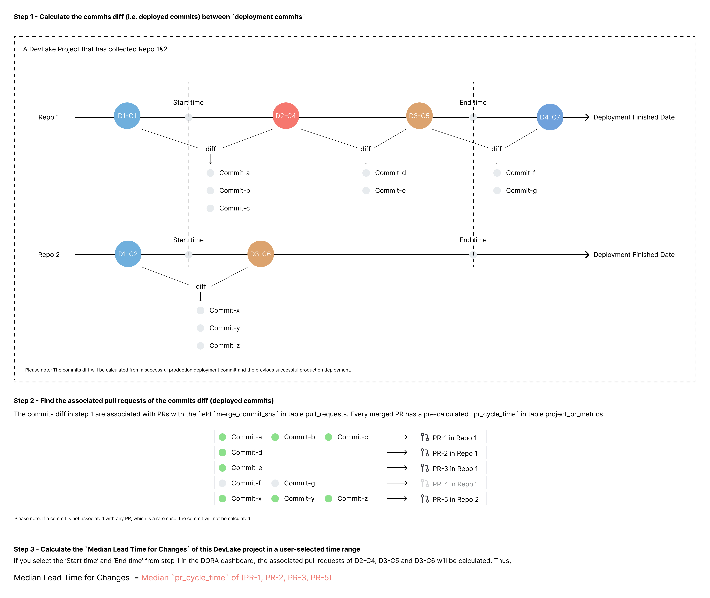

## What is this metric?

The median amount of time for a code change to be deployed into production.

## Why is it important?

This metric measures the time it takes to a code change to the production environment and reflects the speed of software delivery. A lower average change preparation time means that your team is efficient at coding and deploying your project.

## Which dashboard(s) does it exist in

DORA dashboard. See [live demo](https://grafana-lake.demo.devlake.io/grafana/d/qNo8_0M4z/dora?orgId=1).

## How is it calculated?
This metric is quite similar to [PR Cycle Time](PRCycleTime.md). The difference is that 'Lead Time for Changes' uses a different method to filter PRs.

1. Find the PRs' associated deployment commits whose finished_date falls into the time range that users select.
2. Find the associated pull requests of the commits diff between two consecutive successful `deployment commits` in the production environment.
3. Calculate the PRs' median cycle time. This will be the Median Lead Time for Changes.



PR cycle time is pre-calculated by the `dora` plugin during every data collection. You can find it in `pr_cycle_time` in [table.project_pr_metrics](https://devlake.apache.org/docs/DataModels/DevLakeDomainLayerSchema/#project_pr_metrics) of DevLake's database.

Below are the 2023 DORA benchmarks for different development teams from Google's report. However, it's difficult to tell which group a team falls into when the team's median lead time for changes is `between one week and one month`. Therefore, DevLake provides its own benchmarks to address this problem:

| Groups            | Benchmarks                       | DevLake Benchmarks              |
| ----------------- | -------------------------------- | ------------------------------- |
| Elite performers  | Less than one day                | Less than one day               |
| High performers   | Between one day and one week     | Between one day and one week    |
| Medium performers | Between one week and one month   | Between one week and one month  |
| Low performers    | Between one week and one month   | More than one month             |

<p><i>Source: 2023 Accelerate State of DevOps, Google</i></p>

<details>
<summary>Click to expand or collapse 2021 DORA benchmarks</summary>

| Groups            | Benchmarks                       | DevLake Benchmarks              |
| ----------------- | -------------------------------- | ------------------------------- |
| Elite performers  | Less than one hour               | Less than one hour              |
| High performers   | Between one day and one week     | Less than one week              |
| Medium performers | Between one month and six months | Between one week and six months |
| Low performers    | More than six months             | More than six months            |

<p><i>Source: 2021 Accelerate State of DevOps, Google</i></p>
</details>
<br>
</br>

<b>Data Sources Required</b>

- `Deployments` from Jenkins, GitLab CI, GitHub Action, BitBucket Pipelines, Webhook, etc. 
- `Pull Requests` from GitHub PRs, GitLab MRs, BitBucket PRs, Azure DevOps PRs, etc.

<b>Transformation Rules Required</b>

Define `deployment` in [data transformations](https://devlake.apache.org/docs/Configuration/Tutorial#step-3---add-transformations-optional) while configuring the blueprint of a project to let DevLake know what CI records can be regarded as deployments.

<b>SQL Queries</b>

If you want to measure the monthly trend of median lead time for changes as the picture shown below, run the following SQL in Grafana.


```
-- Metric 2: median change lead time per month
with _pr_stats as (
-- get the cycle time of PRs deployed by the deployments finished each month
	SELECT
		distinct pr.id,
		date_format(cdc.finished_date,'%y/%m') as month,
		ppm.pr_cycle_time
	FROM
		pull_requests pr
		join project_pr_metrics ppm on ppm.id = pr.id
		join project_mapping pm on pr.base_repo_id = pm.row_id and pm.`table` = 'repos'
		join cicd_deployment_commits cdc on ppm.deployment_commit_id = cdc.id
	WHERE
		pm.project_name in (${project:sqlstring}+'') 
		and pr.merged_date is not null
		and ppm.pr_cycle_time is not null
		and $__timeFilter(cdc.finished_date)
),

_find_median_clt_each_month_ranks as(
	SELECT *, percent_rank() over(PARTITION BY month order by pr_cycle_time) as ranks
	FROM _pr_stats
),

_clt as(
	SELECT month, max(pr_cycle_time) as median_change_lead_time
	FROM _find_median_clt_each_month_ranks
	WHERE ranks <= 0.5
	group by month
)

SELECT 
	cm.month,
	case 
		when _clt.median_change_lead_time is null then 0 
		else _clt.median_change_lead_time/60 end as median_change_lead_time_in_hour
FROM 
	calendar_months cm
	LEFT JOIN _clt on cm.month = _clt.month
  WHERE $__timeFilter(cm.month_timestamp)
```

If you want to measure in which category your team falls as in the picture shown below, run the following SQL in Grafana.


```
-- Metric 2: median lead time for changes
with _pr_stats as (
-- get the cycle time of PRs deployed by the deployments finished in the selected period
	SELECT
		distinct pr.id,
		ppm.pr_cycle_time
	FROM
		pull_requests pr 
		join project_pr_metrics ppm on ppm.id = pr.id
		join project_mapping pm on pr.base_repo_id = pm.row_id and pm.`table` = 'repos'
		join cicd_deployment_commits cdc on ppm.deployment_commit_id = cdc.id
	WHERE
	  pm.project_name in (${project:sqlstring}+'') 
		and pr.merged_date is not null
		and ppm.pr_cycle_time is not null
		and $__timeFilter(cdc.finished_date)
),

_median_change_lead_time_ranks as(
	SELECT *, percent_rank() over(order by pr_cycle_time) as ranks
	FROM _pr_stats
),

_median_change_lead_time as(
-- use median PR cycle time as the median change lead time
	SELECT max(pr_cycle_time) as median_change_lead_time
	FROM _median_change_lead_time_ranks
	WHERE ranks <= 0.5
)

SELECT 
  CASE
    WHEN ('$benchmarks') = '2023 report' THEN
			CASE
				WHEN median_change_lead_time < 24 * 60 THEN "Less than one day(elite)"
				WHEN median_change_lead_time < 7 * 24 * 60 THEN "Between one day and one week(high)"
				WHEN median_change_lead_time < 30 * 24 * 60 THEN "Between one week and one month(medium)"
				WHEN median_change_lead_time >= 30 * 24 * 60 THEN "More than one month(low)"
				ELSE "N/A. Please check if you have collected deployments/pull_requests."
				END
    WHEN ('$benchmarks') = '2021 report' THEN
		  CASE
				WHEN median_change_lead_time < 60 THEN "Less than one hour(elite)"
				WHEN median_change_lead_time < 7 * 24 * 60 THEN "Less than one week(high)"
				WHEN median_change_lead_time < 180 * 24 * 60 THEN "Between one week and six months(medium)"
				WHEN median_change_lead_time >= 180 * 24 * 60 THEN "More than six months(low)"
				ELSE "N/A. Please check if you have collected deployments/incidents."
				END
		ELSE 'Invalid Benchmarks'
	END AS median_change_lead_time
FROM _median_change_lead_time
```

## How to improve?

- Break requirements into smaller, more manageable deliverables
- Optimize the code review process
- "Shift left", start QA early and introduce more automated tests
- Integrate CI/CD tools to automate the deployment process
