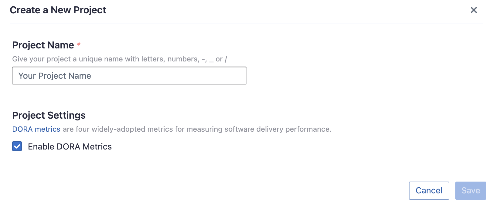
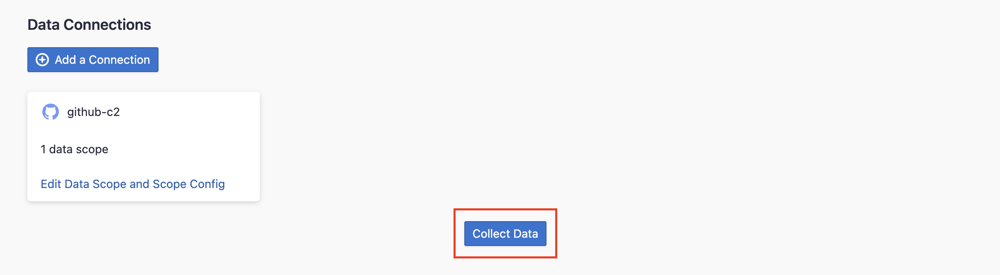

Visit Config UI at : `http://localhost:4000` and go to `Connections` page.

## Step 1 - Add Data Connections

### Step 1.1 - Authentication

#### Connection Name

Give your connection a unique name to help you identify it in the future.

#### Endpoint URL

For CircleCI, you do not need to enter the REST API endpoint URL, which is always `https://circleci.com/api/`.

#### Token

Learn about [Managing API Tokens](https://circleci.com/docs/managing-api-tokens/).

Tokens you have generated that can be used to access the CircleCI API. Apps using these tokens can act as you and have full read- and write-permissions!
There are two types of API token(Personal and Project) you can create within CircleCI.

#### Proxy URL (Optional)

If you are behind a corporate firewall or VPN you may need to utilize a proxy server. Enter a valid proxy server address on your network, e.g. `http://your-proxy-server.com:1080`

#### Fixed Rate Limit (Optional)

DevLake uses a dynamic rate limit to collect CircleCI data. You can adjust the rate limit if you want to increase or lower the speed.
Learn more about [CircleCI API rate limit](https://circleci.com/docs/api-developers-guide/#rate-limits).

#### Test and Save Connection

Click `Test Connection`, if the connection is successful, click `Save Connection` to add the connection.

### Step 1.2 - Configure Data Scope

#### Projects

Select the CircleCI projects to collect.

### Step 1.3 - Adding Scope Config (Optional)
Scope config includes two sets of configurations:
- Data Entities
- Transformations

##### Data Entities

CircleCI only supports `CI/CD` domain entities, which include CircleCI `projects`, `workflows`, `jobs`, and etc.

##### Transformations

This set of configurations is used for calculating [DORA metrics](../DORA.md). 

You can transform a CircleCI workflow run into a DevLake deployment with the following regex:

- Deployment: The given regex should match the name of the Circle workflow run or one of its jobs to be considered as a deployment. For example, if the workflow run used for deployment is named 'build-and-push-image', you can input `(push-image)`. To make the regex case insensitive, you can include `(?i)` before the regex.
- Environment: The given regex should match the workflow run's name to be considered a deployment within the production environment. For instance, if the workflow run used for deployment is named 'deploy-to-prod', you can input `(prod)`. To make the regex case insensitive, you can include (?i) before the regex.

## Step 2 - Collect Data in a Project
### Step 2.1 - Create a Project
Collecting CircleCI data requires creating a project first. You can visit the Project page from the side menu and create a new project by following the instructions on the user interface.

### Step 2.2 - Add a CircleCI Connection
You can add a previously configured CircleCI connection to the project and select the boards for which you wish to collect the data for.
Please note: if you don't see the repositories you are looking for, please check if you have added them to the connection first.

### Step 2.3 - Set the Sync Policy
There are three settings for Sync Policy:
- Data Time Range: You can select the time range of the data you wish to collect. The default is set to the past six months.
- Sync Frequency: You can choose how often you would like to sync your data in this step by selecting a sync frequency option or enter a cron code to specify your preferred schedule.
- Skip Failed Tasks: sometime a few tasks may fail in a long pipeline; you can choose to skip them to avoid spending more time in running the pipeline all over again.

### Step 2.4 - Start Data Collection
Click on "Collect Data" to start collecting data for the whole project. You can check the status in the Status tab on the same page.

## Troubleshooting

If you run into any problem, please check the [Troubleshooting](/Troubleshooting/Configuration.md) or [create an issue](https://github.com/apache/incubator-devlake/issues)
