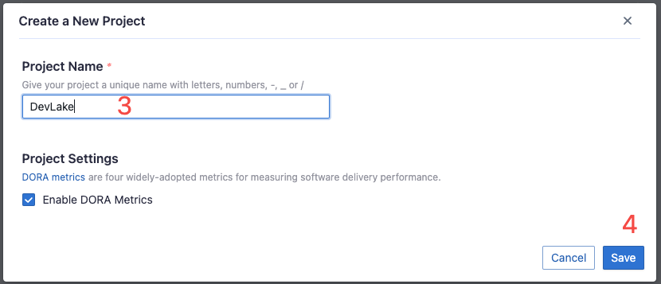
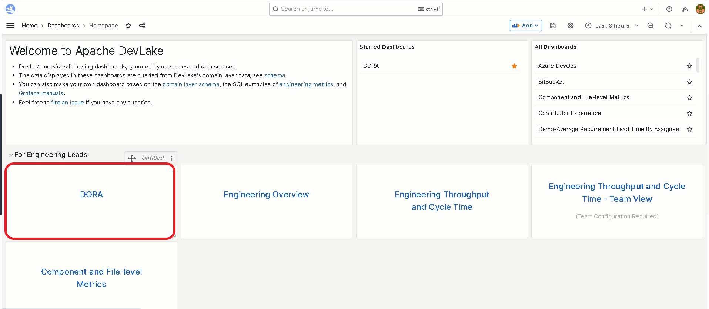
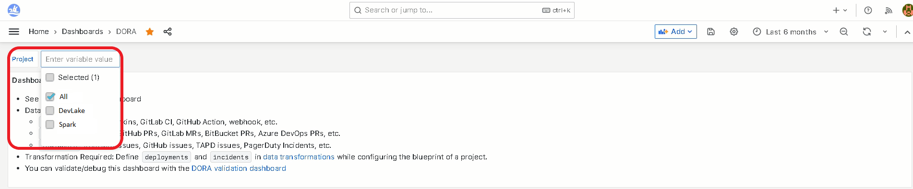

This guide provides a step-by-step approach to organizing projects in DevLake, enabling you to measure DORA metrics according to your specific use cases.

## 1. What is a DevLake project?
On a high level, a DevLake project can be viewed as a real-world project or product line. It represents a specific initiative or endeavor within the software development domain.

On a lower level, a DevLake project is a way of organizing and grouping data from different domains. DevLake uses various [data scopes](/docs/Overview/KeyConcepts.md#data-scope), such as repos, boards, cicd_scopes, and cq_projects as the 'container' to associate different types of data to a specific project. See more on this [doc](/docs/Overview/KeyConcepts.md#project).

## 2. Why is it important to organize projects?

This is crucial due to the fact that DevLake measures DORA metrics at the project level. Each project is associated with specific key entities, such as 'pull requests', 'deployments', and 'incidents', which are used to calculate the corresponding DORA metrics. Therefore, proper project organization ensures accurate and meaningful DORA metric calculations for effective analysis and evaluation.

> How are four [DORA](../DORA.md) metrics calculated from 'pull requests', 'deployments', and 'incidents'?
>
> - [Deployment Frequency](../Metrics/DeploymentFrequency.md): How often does a project `deploys`?
> - [Lead Time for Changes](../Metrics/LeadTimeForChanges.md): How fast are the `pull requests` delivered?
> - [Change Failure Rate](../Metrics/CFR.md): How many `deployments` lead to `incidents`?
> - [Median Time to Restore](../Metrics/MTTR.md): How fast are `incidents` solved?

## 3. Challenges in project organization
There are several challenges associated with organizing projects in DevLake due to different development practices within teams. Some of these challenges include:

- Managing multiple Git repos, issue boards, and CI/CD pipelines within a project.
- Having a Git repo, issue board, or CI/CD pipeline associated with multiple projects, such as in the case of mono-repos or boards used to track incidents from user feedback.
- Managing multiple projects within a team and the need to measure DORA metrics at the team level.
- Projects contributed by multiple teams, with each team requiring the ability to measure their own DORA metrics.

This document serves as a guide to address these challenges and provide assistance in effectively dealing with these diverse development practices.

## 4. General advice

### 4.1. Determining the number of DevLake projects

It is advisable to create DevLake projects that align with the number of real-life projects you have.

For example, if you have a team (Team A) responsible for managing multiple projects, it is recommended to create separate DevLake projects for each individual project instead of creating a single project named 'Team A'. This approach allows for better organization and tracking of metrics specific to each project.

### 4.2 Principles of organizing projects

When organizing projects in DevLake, it is important to associate all relevant [data scopes](/docs/Overview/KeyConcepts.md#data-scope), such as repos, issue boards, and CI/CD scopes, with the corresponding DevLake project based on real-life practices.

In situations where a repo or board is shared by multiple projects in real life, it is recommended to include them in all of these projects within DevLake. This is because DevLake cannot differentiate which commits or issues belong to specific projects. Rather than excluding shared resources from DORA measurements, it is advisable to consider them in all relevant projects.

### 4.3 Measuring DORA at the team level

To clarify the concepts, let's define three terms:

- [`Project`](/docs/Overview/KeyConcepts.md#project): Refers to a real-world project or product line, such as Apache DevLake or Apache Spark. It focuses on the work to be done.
- `Team`: Represents a department, such as the 'product team' or 'engineering team'. It focuses on the people and their roles. Note that people within the same team may not always work on the same projects.
- `Project Team`: Comprises individuals working on a specific project.

DevLake does support measuring DORA metrics at the project-team level, which is essentially the same as measuring at the project level. However, it is important to note that DevLake does not recommend measuring DORA metrics at the team level. Despite the existence of the 'DORA by team' dashboard contributed by the community. Doing so may introduce inaccuracies and dilute the significance of measuring DORA metrics from the outset.

## 5. Use Cases
This section demonstrates real-life practices and how they get reflected in DevLake.

Disclaimer: _To keep this guide shorter, some technical details are only mentioned in
[Use Case 1](HowToOrganizeDevlakeProjects#41-use-case-1-apache-projects),
so if you read this page for the first time, make sure to go through them in order._

Note: _If you use webhooks, check the [quick note](HowToOrganizeDevlakeProjects#5-about-webhooks) about them below._

### 5.1. Use Case 1: Apache Projects
Apache Software Foundation (ASF) has and is developing many
[projects](https://en.wikipedia.org/wiki/List_of_Apache_Software_Foundation_projects).

To take an example we will analyze 2 `projects`: DevLake and [Spark](https://spark.apache.org/).
Both are independent of each other. Assume that ASF wants to check the health of the development
and maintenance of these projects with DORA.

DevLake manages 3 `repos`: [incubator-devlake](https://github.com/apache/incubator-devlake), 
[incubator-devlake-website](https://github.com/apache/incubator-devlake-website), 
and [incubator-devlake-helm-chart](https://github.com/apache/incubator-devlake-helm-chart).
There are many repos related to _Spark_ in one way or another. To keep it simple, 
we will also pick 3 `repos`: [spark](https://github.com/apache/spark),
[spark-website](https://github.com/apache/spark-website), and [incubator-livy](https://github.com/apache/incubator-livy).

Both projects use GitHub for storing code (including `pull requests`), `deployments` on GitHub Actions, and `incidents`.

Note: _To avoid confusion between DevLake as a `project` in this use case and DevLake as a platform,
we will use complete names i.e. `project DevLake` and `platform DevLake` respectively._

#### 5.1.1. Organizing Projects
First, create two projects on the DevLake platform, one for DevLake and one for Spark. 
These will represent real-world projects.

Once these are created, the connections created in the following steps will be bound to them.

#### 5.1.2. Creating Connections

Since all is on GitHub in this case, we can use just 1 connection with the following properties:
- it includes all the project's `repos`
- its scope includes everything we work with (i.e. `pull requests`, `deployments`, and `incidents`)

If you store `incidents` on Jira, for example, you will need to create a separate connection just for them.
The same applies to `deployments`, a separate connection is needed in case they are stored in Jenkins (or any other host for `deployments`).

#### 5.1.3. Configuring Connections
This part is described in [GitHub](../Configuration/GitHub.md) connection configuration. Please check the [configuration guide](../Configuration/Tutorial.md) for configuring other data sources.

#### 5.1.4. Using Connections

At this point, we have projects and connections created on the platform DevLake. 
It is time to bind those connections to the projects. To do so, follow the steps described in the [Tutorial](../Configuration/Tutorial.md).

#### 5.1.5. Resulting Metrics

To know if the data of a project is successfully collected to your DORA Dashboard:

If everything goes well, you should see all the 4 charts.
If something is wrong, and you are puzzled as to why, check out the
[Debugging Dora Issue Metrics](../Troubleshooting/Dashboard.md#debugging-dora-issue-metrics) page.

#### 5.1.6. How can I observe metrics by project?
In the same DORA dashboard check out this menu point:

The metrics should change when you select or deselect projects, representing the projects you selected.

### 5.2. Use Case 2: Multiple Teams with Distinct Projects

Consider a scenario where a company operates with several teams, each managing one or more projects. 
For illustration, we will explore two such teams: the Payments team and the Internal Tools team. 
Here's a simplified representation of this scenario:

#### Quick Overview:
- The Payments team works on a single project: “payments”.
- The Internal Tools team manages two projects: “it-legacy” and “it-new”.
- Both teams use different sets of tools and boards.

#### Step-by-Step Simplification:
1. **Define the Teams and Projects:**
   - **Payments Team**:
     - One project: "payments". 
   - **Internal Tools Team**:
     - Two projects: "it-legacy" and "it-new". 
2. **Understand the Tools**:
   - Assume both teams utilize GitHub for `repos` and Jenkins for CI/CD.
   - The _Payments_ team uses Jira boards.
   - The _Internal Tools_ team uses webhooks for reporting incidents.

#### 5.2.1. Organizing Projects

DORA is effective for observing the impacts of methodology changes within a team.
From DORA’s standpoint, the concept of distinct `teams` is not recognized; only `projects` exist. 
Adding a `team` concept introduces unnecessary complexity without providing any substantial benefit. 

In DevLake, we create three `projects`: _payments_, _it-legacy_, and _it-new_.

It is crucial to maintain **atomic** `projects`, representing the smallest, independent units, 
to prevent complexity and ensure precise data representation. **Atomic** `projects` allow for a more flexible 
and accurate data comparison and combination between `projects`.

#### 5.2.2. Adding Connections

Create just one connection and reuse it across projects by adding data scopes.
This method optimizes data collection, minimizing redundancy and ensuring more efficient use of resources.

It is NOT recommended to create multiple connections, for instance, GitHub repos, as it  
will increase the time to collect the data due to the storage of multiple copies of shared repos in the database.

The only exception is the webhooks: **we must have 1 connection per project**, 
as this is the only way DevLake can accurately assign `incidents` to the corresponding `project`.

So, in total we will have only these connections:
- 1 connection for all GitHub `repos` to collect `pull requests`
- 1 connection to Jenkins to collect all `deployments`
- 1 connection to Jira to collect `incidents`
- 2 webhook connections to collect `incidents`: 1 per each `project` that uses webhooks (_it-legacy_ and _it-new_)

The step-by-step [Configuration Guide](../Configuration/Tutorial.md) shows how to both add connections and set scopes as described in the next chapter.

#### 5.2.3. Setting Scopes
Now, add the connections to our projects and set the scope to them:

For payments `project`: 
- add 1 scope to GitHub connection for _p1...p10_ `repos` to collect their `pull requests`
- add 1 scope to Jenkins for `deployments` of _p1...p10_ `repos`
- add 1 scope to Jira to collect `incidents`

For it-legacy `project`:
- add 1 scope to GitHub for `repos` _it-legacy-1_, _it-legacy-2_, _it-core-1_ and _it-core-2_ to collect their `pull requests`
- add 1 scope to Jenkins for `deployments` of _it-legacy-1_, _it-legacy-2_, _it-core-1_ and _it-core-2_ `repos`
- include the _it-legacy_ webhook for collecting `incidents`

For it-new `project`:
- add 1 scope to GitHub for `repos` _it-new-1_, _it-new-2_, _it-core-1_ and _it-core-2_ to collect their `pull requests`
- add 1 scope to Jenkins for `deployments` of _it-new-1_, _it-new-2_, _it-core-1_ and _it-core-2_ `repos`
- include the _it-new_ webhook for collecting `incidents`

#### 5.2.4. Resulting Metrics
See [5.1.5 Resulting Metrics](HowToOrganizeDevlakeProjects#515-resulting-metrics)

## 6. About Webhooks
**Assigning a UNIQUE webhook to each project is critical.** This ensures that the DevLake platform 
correctly associates the incoming data with the corresponding project through the webhook.

If you use the same webhook across multiple projects, the data sent by it **will be replicated per each
project that uses that webhook**. More information available on the [Webhook](/docs/Plugins/webhook.md) page

## 7. Troubleshooting

Please check out the [Debugging DORA Issue Metrics](../Troubleshooting/Dashboard.md#debugging-dora-issue-metrics) to debug DORA dashboard.

If you still run into any problems, please check the [Troubleshooting](/docs/Troubleshooting/Configuration.md) or [create an issue](https://github.com/apache/incubator-devlake/issues)