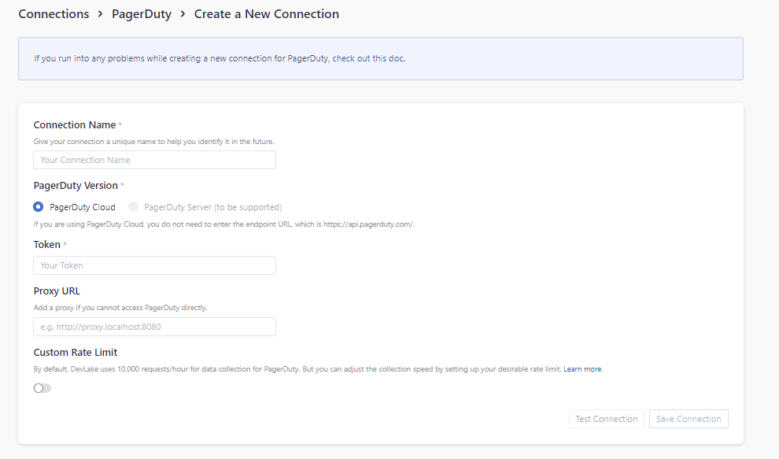
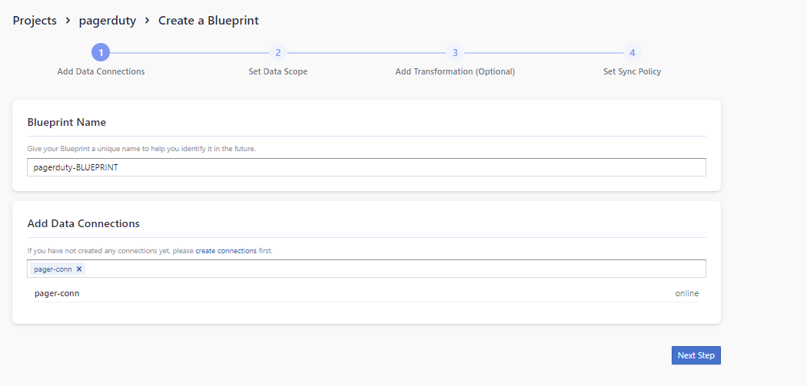

Visit Config UI at: `http://localhost:4000`.

## Step 1 - Add Data Connections

### Connection Name

Give your connection a unique name to help you identify it in the future.

### Token

Paste your PagerDuty personal access token (PAT) here. You may make it a Read-Only token for the plugin's purposes.

### Test and Save Connection

Click `Test Connection`, if the connection is successful, click `Save Connection` to add the connection.

## Step 1 - Add Data Connection

Create a project for PagerDuty by adding the connection created above to it.

## Step 2 - Setting Data Scope

### Select services

Select the services you want to collect data from.

### Data Entities

PagerDuty supports the following data entities.

- Issue Tracking: These map to PagerDuty incidents.

## Step 3 - Adding Transformation Rules (Optional)

Currently, this plugin does not support transformation rules, so skip this page by clicking `Next Step`.

## Step 4 - Set Sync Policy

Set the sync policy as you see fit. Note that PagerDuty can only collect data from up to 6 months prior to the present time.

## Troubleshooting

If you run into any problem, please check the [Troubleshooting](/Troubleshooting/Configuration.md) or [create an issue](https://github.com/apache/incubator-devlake/issues)
